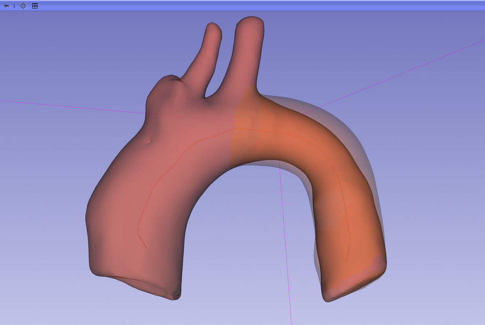
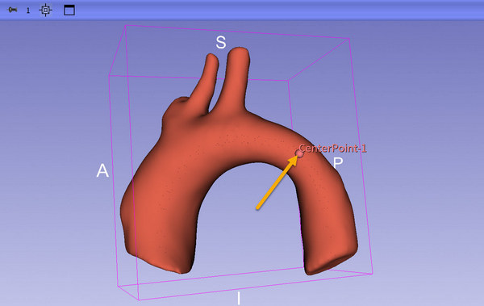
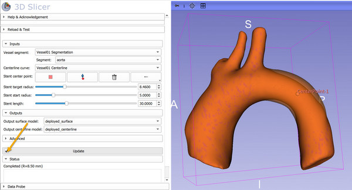

# Virtual Cath Lab

## Summary

Simulate stent deployment using [svMorph](https://github.com/SimVascular/svMorph).




## Tutorial

- Go to `Sample Data` module and in `SimVascular` category click `Vessel01`. This loads a vessel segmentation and centerline. For using on your own data: segmentation can be created using `Segment Editor` module, centerline can be automatically created using `SlicerVMTK` extension's `Extract Centerline` module.
- Go to `Deploy Stent` module
- Select `Vessel segment` -> `Vessel01 Segmentation`
- Select `Segment` -> `aorta`
- Select `Centerline curve` -> `Vessel01 Centerline`
- Select stent location by clicking the arrow button in the `Stent center point` row, then click on the stenosis (the narrowing where stent placement will be simulated)



- Click the `Update` button to expand the vessel (deploy the stent). The generated expanded vessel model should be visible in about 10-20 seconds. First time it may take a few minutes to download require Python packages.
- Click the checkbox on the `Update` button to make the model update automatically whenever any parameter is changed.
- Increase and decrease the `Stent target radius` and other parameters. The generated mesh will be updated accordingly.



## References

[svMorph: Interactive geometry-editing tools for virtual patient-specific vascular anatomies](https://arxiv.org/abs/2210.07087)

```
@misc{pham2022svmorphinteractivegeometryeditingtools,
      title={svMorph: Interactive geometry-editing tools for virtual patient-specific vascular anatomies}, 
      author={Jonathan Pham and Sofia Wyetzner and Martin R. Pfaller and David W. Parker and Doug L. James and Alison L. Marsden},
      year={2022},
      eprint={2210.07087},
      archivePrefix={arXiv},
      primaryClass={physics.med-ph},
      url={https://arxiv.org/abs/2210.07087}, 
}
```
