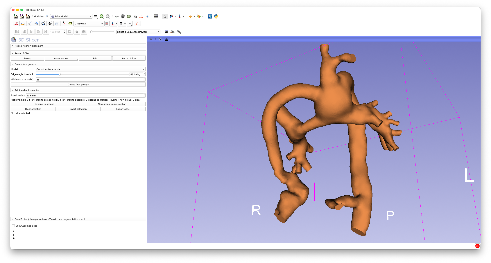
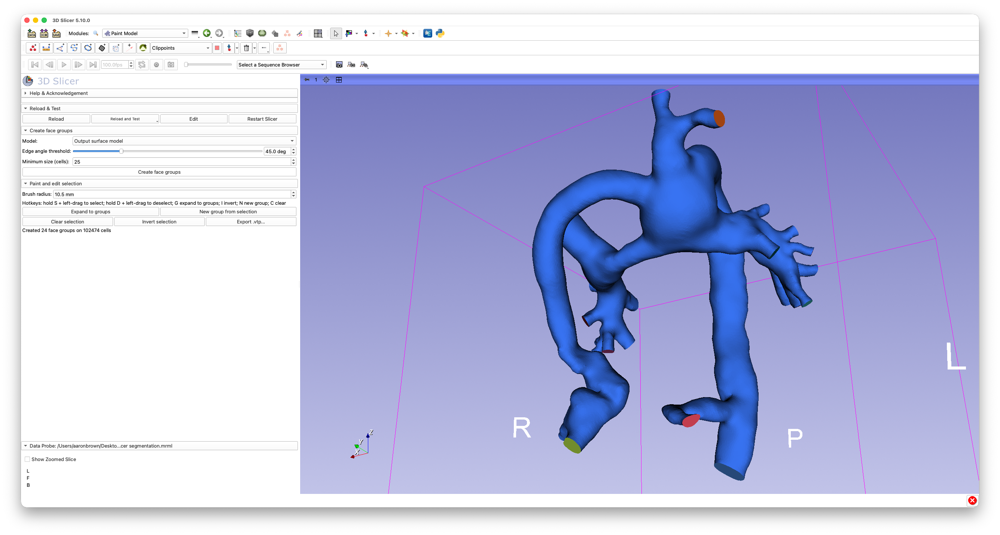
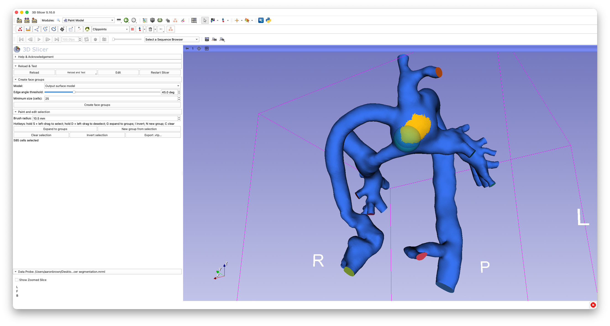

# Paint Model (PaintModel)

## Summary

Interactively paint, group, and export face regions on a surface model.
Polygons are automatically partitioned into "face groups" using a
dihedral-angle threshold, then you can brush-paint to select cells, expand
a selection to whole groups, carve a new group out of a selection, and
export the labeled surface (a `ModelFaceID` cell array) to a `.vtp` file.

Typical uses include marking inlet/outlet caps and named regions on a
vascular or organ surface model before meshing or boundary-condition
assignment.

The workflow is inspired by the face-grouping tools in
[Autodesk Meshmixer](https://meshmixer.com/): automatically segment a mesh
into flat-ish regions using a dihedral-angle threshold, then refine those
regions by hand with a selection brush, growing/inverting/clearing the
selection, and splitting off new groups.

*A clipped Fontan vascular geometry, before any face groups have been
created.*

## Tutorial

- Go to the `Paint Model` module.
- In the `Create face groups` panel, select the `Model` you want to work on.
- Adjust `Edge angle threshold`: adjacent polygons stay in the same group as
  long as the angle between their normals is at most this value. Lower
  values produce more, smaller, flatter groups.
- Adjust `Minimum size (cells)`: any group smaller than this cell count is
  merged into the neighboring group with which it shares the longest
  boundary.
- Click `Create face groups`. Each group is rendered with a stable color;
  the status label reports how many groups were created.

*Result of clicking `Create face groups` on the same model: the edge-angle
threshold and minimum-size settings automatically identify the flat cap
surfaces (and other flat regions) as their own groups.*

- In the `Paint and edit selection` panel, set the `Brush radius` used by
  the hotkeys below.
- In the 3D view:
  - Hold `S` and left-drag to select cells within the brush radius.
  - Hold `D` and left-drag to deselect cells.
  - Press `G` (or click `Expand to groups`) to expand the current selection
    to every cell in the touched groups.
  - Press `I` (or click `Invert selection`) to invert the selection.
  - Press `N` (or click `New group from selection`) to carve the current
    selection out into its own new face group.
  - Press `C` (or click `Clear selection`) to clear the selection.
  - The active selection is always highlighted in yellow.

*The selection brush (cyan sphere) being used to manually paint a region
that wasn't already captured as its own automatic face group — hold `S`
and drag to select, then click `New group from selection` to carve it out.*

- When you're happy with the groups, click `Export .vtp...` and choose a
  file location. The exported model has a `ModelFaceID` cell array with
  consecutive integer labels, one per face group.

## Notes

- Face-group data is stored directly on the model's polydata as a
  `ModelFaceID` cell array, so it persists with the model for as long as
  the scene is open (and is written out on export).
