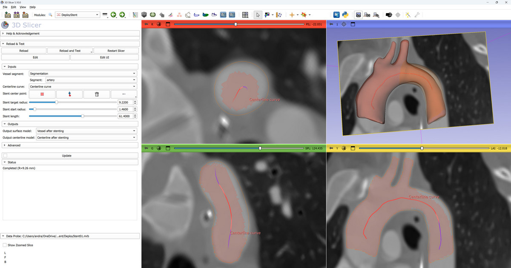

# SimVascular extension for 3D Slicer

This repository provides 3D Slicer modules for [SimVascular](https://github.com/SimVascular/SimVascular) developed by Marsden lab members and associates.

## Modules

- [Virtual Stent (SDFStent)](Docs/SDFStent.md): Expand vessel to simulate stent deployment using SDFStent algorithm (provided by svMorph Python package).

## How to cite?

See [SimVascular website](https://simvascular.github.io/).

## Contact information

See [SimVascular website](https://simvascular.github.io/).
